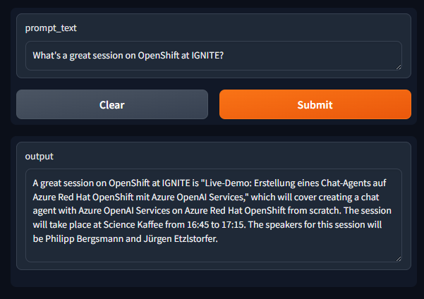

# Demo for showcasing RAG with Azure OpenAI services


## Setup & Prerequisites


### Azure OpenAI Models

Tested with Azure OpenAI models `gpt-35-turbo` and `text-embedding-ada-002`.

Name of models in the code (can be changed, of course):
- `gpt-35-turbo`
- `text-embedding-3-small`

### Environment variables

Populate a `.env` file with the following variables:

```bash	
AZURE_OPENAI_API_KEY=
AZURE_OPENAI_ENDPOINT=
```

### Run it locally via Docker

```bash
docker build -t rag-demo .
docker run --env-file ./.env -p 8080:8080 rag-demo
```

### Demo run

Open a browser and navigate to http://localhost:8080/




### Acknowledgements

Thanks to [Philipp Bergsmann](https://github.com/phbergsmann/ms-ignite-2024-vie) for the initial implementation of the RAG model with Azure OpenAI services.
